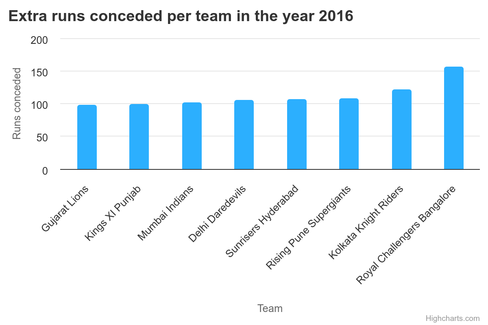
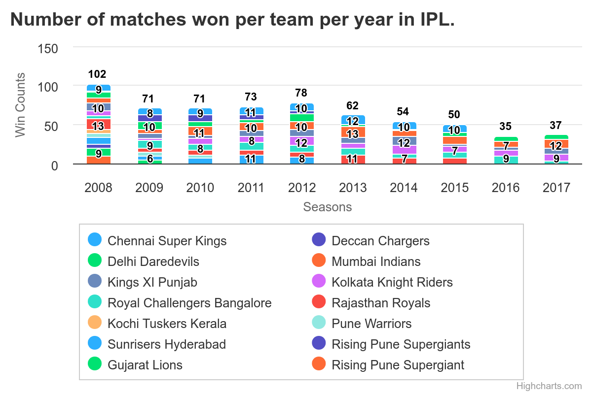
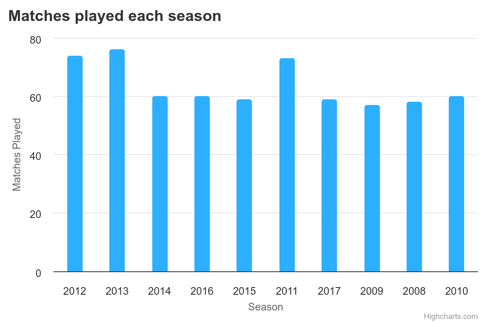

# Django IPL Project

## Aim
- Get familiar with Django MVC
- Get familiar with Django ORM - migrations, queries with joins and aggregations, using transactions

## Problems

- Number of matches played per year for all the years in IPL.

- Number of matches won per team per year in IPL.

- Extra runs conceded per team in the year 2016

 
- Top 10 economical bowlers in the year 2015

